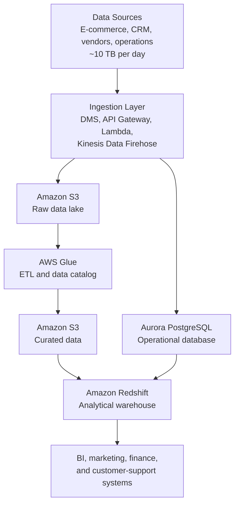
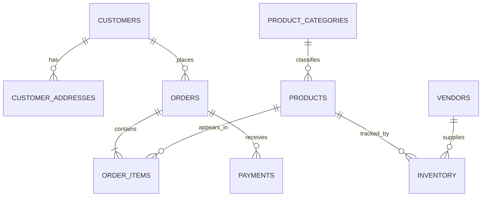

# AWS Cloud Database Architecture for E-Commerce

## Project Overview

This project presents a proposed cloud data architecture for **Alliah Company**, a growing e-commerce retailer experiencing scalability, reliability, and security limitations within its on-premises data environment.

The company generates approximately **10 TB of structured and semi-structured data each day** through its e-commerce platform, customer service systems, third-party vendors, and internal operations. The proposed solution uses Amazon Web Services (AWS) to create a scalable platform for transactional processing, data lake storage, analytics, security, backup, and disaster recovery.

> **Project scope:** This repository contains an architecture and database design proposal. It does not represent a production AWS deployment.

## Business Problem

Alliah Company requires a cloud data platform capable of:

- Processing transactions and customer activity continuously
- Scaling as transaction volume and the customer base grow
- Integrating data from multiple operational systems
- Supporting business intelligence and analytical workloads
- Protecting personally identifiable information and transaction records
- Maintaining high availability with minimal service interruption
- Providing reliable backup and disaster recovery capabilities
- Managing storage costs through data lifecycle policies

The data supports sales and marketing strategy, inventory management, customer relationship management, financial reporting, and operational decision-making.

## Proposed Solution

The proposed architecture separates operational, analytical, and archival workloads across specialized AWS services:

- **Amazon Aurora PostgreSQL** manages structured transactional data.
- **Amazon S3** provides scalable storage for raw, curated, historical, and archived data.
- **Amazon Redshift** supports business intelligence and large-scale analytical queries.
- **AWS Kinesis Data Firehose, AWS DMS, API Gateway, and AWS Lambda** support continuous data ingestion.
- **AWS Glue** performs scheduled data transformation and cataloging.
- **AWS IAM and AWS KMS** provide access control and encryption.
- **Amazon CloudWatch and AWS CloudTrail** support monitoring and auditing.
- **AWS Backup, database snapshots, versioning, and cross-region replication** provide data protection and disaster recovery.

## Architecture



The environment would operate inside an Amazon VPC. Aurora and Redshift would be placed in private subnets, with security groups controlling access between ingestion, database, and analytical resources.

## Core AWS Services

| AWS Service | Role in the Architecture |
|---|---|
| Amazon Aurora PostgreSQL | Processes orders, payments, customer accounts, products, and inventory |
| Amazon S3 | Stores raw files, curated datasets, historical records, and archived data |
| Amazon Redshift | Supports reporting, forecasting, and large-scale analytical queries |
| AWS Database Migration Service | Supports database migration and ongoing change-data capture |
| Kinesis Data Firehose | Delivers streaming records to cloud storage and analytics services |
| Amazon API Gateway | Receives data from applications and external services |
| AWS Lambda | Performs event-driven validation and processing |
| AWS Glue | Runs ETL workflows and maintains the data catalog |
| AWS IAM | Enforces role-based access and least-privilege permissions |
| AWS KMS | Manages encryption keys for protected data |
| Amazon CloudWatch | Monitors system performance, logs, and operational events |
| AWS CloudTrail | Records account activity for security and compliance auditing |
| AWS Backup | Centralizes backup schedules and retention policies |

## Storage Strategy

Amazon S3 provides separate storage layers for different stages of the data lifecycle:

- **Raw:** Original transaction logs, customer interactions, clickstream data, and vendor files
- **Curated:** Validated and transformed datasets prepared for analysis
- **Archived:** Historical records retained for compliance or recovery

Lifecycle policies would transition data between the following storage classes:

- **S3 Standard** for frequently accessed current data
- **S3 Standard-Infrequent Access** for older, less frequently accessed data
- **S3 Glacier or Glacier Deep Archive** for long-term retention

This tiered approach balances data availability with long-term storage costs.

## Relational Database Design

Amazon Aurora PostgreSQL serves as the operational relational database. The design separates customer, sales, product, payment, vendor, and inventory data into normalized objects.

### Primary Database Objects

| Object | Purpose |
|---|---|
| `Customers` | Stores customer identity, contact, and account information |
| `Customer_Addresses` | Maintains multiple billing and shipping addresses per customer |
| `Orders` | Records customer purchases, order dates, statuses, and totals |
| `Order_Items` | Stores the individual products and quantities within each order |
| `Products` | Maintains product descriptions, SKUs, brands, and prices |
| `Product_Categories` | Organizes products into reporting and catalog classifications |
| `Payments` | Records payment methods, amounts, statuses, and transaction references |
| `Vendors` | Maintains information about third-party suppliers |
| `Inventory` | Tracks product quantities, availability, and reorder thresholds |

### Entity Relationships



This structure reduces data duplication, maintains referential integrity, and supports reliable order processing and reporting.

## Analytical Data Model

Amazon Redshift separates analytical workloads from operational transaction processing. Proposed warehouse schemas include:

- `sales_mart` for order, product, and revenue analysis
- `marketing_mart` for campaign and customer-behavior analysis
- `finance_mart` for payment, reconciliation, and financial reporting

Potential analytical use cases include:

- Sales trend analysis
- Customer segmentation
- Marketing campaign evaluation
- Inventory forecasting
- Vendor performance analysis
- Executive dashboards and financial reporting

## Security and Compliance

The architecture applies defense-in-depth controls to protect customer and transaction data:

- Encryption at rest using AWS KMS
- TLS encryption for data in transit
- Least-privilege access through IAM roles and policies
- Private subnets for Aurora and Redshift
- Security groups and network access control lists
- Centralized logging through CloudWatch and CloudTrail
- Database activity monitoring and audit records
- Data classification, retention, and secure-deletion policies
- Protection of personally identifiable information
- Support for GDPR and other applicable privacy requirements

Public access to the operational database and analytical warehouse would be disabled.

## Backup and Recovery Strategy

The backup plan uses multiple protection methods based on workload criticality.

### Aurora PostgreSQL

- Continuous automated backups
- Point-in-time recovery
- Daily database snapshots
- Multi-AZ replication and automatic failover
- Cross-region copies for critical recovery points

### Amazon Redshift

- Daily automated snapshots
- Manual snapshots before major schema or data changes
- Cross-region snapshot copies where required

### Amazon S3

- Continuous object versioning
- Cross-region replication for critical datasets
- Lifecycle transitions to archival storage
- Retention policies based on legal and operational requirements

Incremental backups, automated snapshots, and lifecycle-based archival provide a more cost-effective strategy than repeatedly creating full copies of approximately 10 TB of daily data.

## High Availability and Disaster Recovery

The proposed design uses:

- Multi-AZ Aurora deployment
- Automatic database failover
- S3 durability across multiple availability zones
- Cross-region replication for critical data
- Redshift snapshots and regional recovery procedures
- Infrastructure monitoring and automated alerts
- Documented recovery time and recovery point objectives

Transactional systems require the lowest recovery time objective (RTO) and recovery point objective (RPO) because order, payment, and customer data are mission-critical. Analytical and archival systems may tolerate longer recovery periods.

## Functional Requirements Addressed

- High-volume structured and semi-structured data storage
- Continuous and near-real-time ingestion
- Integration with internal and external data sources
- Transaction processing with relational integrity
- Business intelligence and reporting
- Automated backup, recovery, and failover

## Non-Functional Requirements Addressed

- Scalability
- High availability
- Security
- Performance
- Reliability
- Cost efficiency
- Regulatory compliance
- Disaster recovery readiness

## Skills Demonstrated

- Cloud database architecture
- Relational data modeling
- AWS service selection
- Data lake and data warehouse design
- Transactional and analytical workload separation
- Real-time data ingestion planning
- Database normalization
- Security and access-control design
- Backup and disaster recovery planning
- Data lifecycle and storage-cost optimization
- Technical documentation and architecture communication

## Repository Structure

```text
.
├── diagrams/
│   ├── aws-cloud-architecture.png
│   └── logical-data-model.png
├── documentation/
│   └── cloud-data-solution-proposal.pdf
└── README.md
```

> Update this repository structure to match the final filenames and directories used in the repository.

## Future Enhancements

Potential next steps include:

- Provisioning the infrastructure with Terraform or AWS CloudFormation
- Implementing a sample Aurora PostgreSQL schema
- Creating AWS Glue ETL jobs
- Adding Redshift dimensional models
- Configuring automated data-quality checks
- Defining measurable RTO and RPO targets
- Developing cost estimates using the AWS Pricing Calculator
- Building a CI/CD pipeline for infrastructure changes
- Adding sample SQL queries and analytical dashboards

## Author

**Taylor Wilkerson**

Data Analytics | Data Engineering | Cloud Architecture
